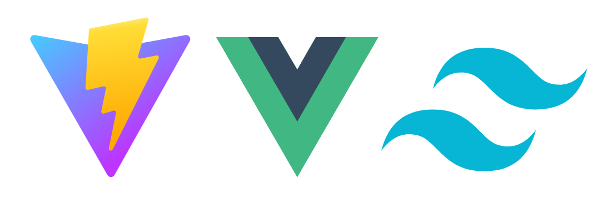

# Personal Website

This is a personal website I am developing for my web development class at PSU. The goal is to use what I have learned from school and experience to create a portfolio of my work.

## Tech Stack

Given that this is hosted on GitHub Pages, no server/backend is needed. So this is a static site. For this project, I went with this tech stack:



- [Vite](https://vitejs.dev/)
- [Vue](https://vuejs.org/)
- [Tailwind](https://tailwindcss.com/)

I have used Vue as a front end framework.
Tailwind for a styling library.
And Vite for development.

## Project Setup

```sh
yarn install
```

This installs all the necessary dependancies for both development and production.

### Compile and Hot-Reload for Development

```sh
yarn start
```

This will run both `yarn dev` & `yarn tailwind` using concurrently.
`yarn dev` calls `vite`, which allows the app to hot reload during development.
`yarn tailwind` calls `npx tailwindcss -i ./src/input.css -o ./dist/output.css --watch`.

### Customize Configuration Files

- [Vite](https://vitejs.dev/config/)
- [Tailwind](https://tailwindcss.com/docs/configuration)

### Compile and Minify for Production

```sh
yarn build
```

### Run Unit Tests with [Vitest](https://vitest.dev/)

```sh
yarn test
```
